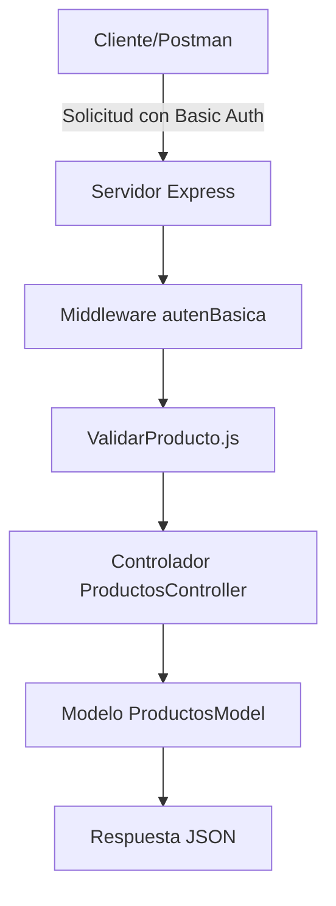

# Mini Proyecto de Integración o API RESTful de Productos de Aseo Natan Hernandez

---

## Descripción del Proyecto

Este proyecto consiste en el desarrollo de una **API RESTful** con **Node.js** y **Express** para gestionar un inventario de **productos de aseo**, el cual tiene como objetivo el uso de bases y estructuras de back end 
y la aplicacion de principios de programacion y metodos de desarrollo web, implementando algunas cosas como  pruebas automatizadas, y buenas prácticas de integración continua.

---

## Funcionalidades

La API permite realizar operaciones como (get,put,post y delete) sobre los productos.

| Método | Endpoint | Descripción |
|--------|-----------|-------------|
| **GET** | `/api/productos` | Obtiene la lista completa de productos |
| **GET** | `/api/productos/:id` | Obtiene un producto específico |
| **POST** | `/api/productos` | Crea un nuevo producto |
| **PUT** | `/api/productos/:id` | Actualiza un producto existente |
| **DELETE** | `/api/productos/:id` | Elimina un producto del sistema |

Ejemplo de producto:
IMAGEN

## Arquitectura y Organización del Proyecto

Esta API RESTful sigue una arquitectura MVC (Modelo-Vista-Controlador) tal como lo pedia la docente en distintos encuentros sincronicos, donde se separan responsabilidades para facilitar el mantenimiento del código.
### 📁 Estructura del proyecto:
IMAGEN

---

## ⚙️ Instalación y Ejecución

### 🔧 Requisitos previos:
- Tener instalado **Node.js (v18 o superior)**
- Tener **Git** configurado
- Tener **Visual Studio Code**
- Tener **Postman** para pruebas de endpoints

### 🧱 Instalación:
1️⃣ Clonar el repositorio:
```bash
git clone https://github.com/NatanHernandez/mini-proyecto-de-integracion.git
```

2️⃣ Acceder a la carpeta:
```bash
cd mini-proyecto-de-integracion
```

3️⃣ Instalar dependencias:
```bash
npm install
```

4️⃣ Ejecutar el proyecto:
```bash
npm run dev
```

5️⃣ O iniciar manualmente:
```bash
npm start
```

Servidor disponible en:  
👉 [http://localhost:3000](http://localhost:3000)

---

## 🔐 Autenticación Básica

Toda la API está protegida por autenticación **Basic Auth**.  
Debes enviar tus credenciales en cada solicitud.

| Campo | Valor |
|-------|--------|
| **Usuario** | `natan` |
| **Contraseña** | `1202` |

### Ejemplo de encabezado:
```
Authorization: Basic bmF0YW46MTIwMg==
```

Si las credenciales son incorrectas, el servidor responderá con:
```
403 Credenciales incorrectas
```

---

## 🧪 Pruebas con Postman

Se realizaron pruebas en **Postman** para verificar los endpoints:

✅ `GET /api/productos` — listar productos  
✅ `POST /api/productos` — crear un producto  
✅ `PUT /api/productos/:id` — actualizar un producto  
✅ `DELETE /api/productos/:id` — eliminar un producto  

Todas las rutas fueron probadas con autenticación básica y devuelven los códigos esperados (`200`, `201`, `404`).

---

## 🧠 Middleware Personalizados

### 🔸 `autenBasica.js`
Verifica credenciales del usuario para acceder a los endpoints.

### 🔸 `validarProducto.js`
Valida que los datos del producto sean correctos antes de crear o actualizar:
- Nombre no vacío
- Precio numérico y mayor que 0

---

## 📦 Modelo de Datos

Definido en `productosModel.js`, simula una base de datos en memoria:

```js
let productos = [
  { id: 1, nombre: "Jabón", precio: 3700, stock: 10 },
  { id: 2, nombre: "Shampoo", precio: 8000, stock: 5 }
];
```

---

## 🧰 Integración Continua (CI)

El proyecto usa **GitHub Actions** para ejecutar pruebas automáticamente con Jest cada vez que se hace un push o pull request en la rama `main`.

Archivo `.github/workflows/ci.yml`:
```yaml
name: CI - Integración continua del proyecto

on:
  push:
    branches: [ "main" ]
  pull_request:
    branches: [ "main" ]

jobs:
  build:
    runs-on: ubuntu-latest

    steps:
      - name: Clonar el repositorio
        uses: actions/checkout@v4

      - name: Configurar Node.js
        uses: actions/setup-node@v4
        with:
          node-version: "18"

      - name: Instalar dependencias
        run: npm install

      - name: Ejecutar pruebas con Jest
        run: npm test
```

---

## 🧪 Pruebas Automatizadas con Jest y Supertest

Archivo: `test/productos.test.js`

```js
const request = require('supertest');
const app = require('../app');

describe('Pruebas del endpoint de productos', () => {
  it('Debe responder con código 200 en /api/productos', async () => {
    const res = await request(app)
      .get('/api/productos')
      .auth('natan', '1202');
    expect(res.statusCode).toBe(200);
  });
});
```

Ejecutar pruebas:
```bash
npm test
```

---

## 🧩 Buenas Prácticas Aplicadas

- Estructura modular (MVC)
- Middlewares para autenticación y validación
- Control de errores HTTP
- Pruebas automatizadas (Jest + Supertest)
- Flujo de CI/CD funcional (GitHub Actions)
- Uso de Postman para pruebas manuales
- Uso de `.gitignore` y manejo de dependencias limpio
- Código limpio, comentado y documentado

---

## 📈 Estado del Proyecto

| Área | Estado |
|------|--------|
| **CRUD completo** | ✅ |
| **Autenticación básica** | ✅ |
| **Validación de datos** | ✅ |
| **Pruebas Postman** | ✅ |
| **Pruebas Jest** | ✅ |
| **Integración continua (CI)** | ✅ |
| **README documentado** | ✅ |

📊 **Porcentaje de cumplimiento estimado:**  
**100% — Proyecto completo y funcional**

---

## 🧭 Flujo del Proyecto (Diagrama)



---

## 👨‍💻 Autor

**Natan Hernández**  
Proyecto académico — *Desarrollo de Servicios Web / Ingeniería de Software*  
📅 Año: **2025**

---

## 🏁 Licencia

Este proyecto se distribuye bajo la licencia **ISC**.
Puedes modificar y utilizar el código con fines académicos o de aprendizaje.
