# Mini Proyecto de Integración o API RESTful de Productos de Aseo Natan Hernandez

---

## Descripción del Proyecto

Este proyecto consiste en el desarrollo de una **API RESTful** con **Node.js** y **Express** para gestionar un inventario de productos de aseo, el cual tiene como objetivo el uso de bases y estructuras de back end 
y la aplicacion de principios de programacion y metodos de desarrollo web, implementando algunas cosas como  pruebas automatizadas, y buenas prácticas de integración continua.

---

## Funcionalidad

La API permite realizar operaciones como (get,put,post y delete) sobre los productos,las pruebas de estas se hicieron en postman y se anexaran mas adelante con algunas imagenes para una mayor comprension de este.

| Método | Endpoint | Descripción |
|--------|-----------|-------------|
| **GET** | `/api/productos` | Obtiene la lista completa de productos |
| **POST** | `/api/productos` | Crea un nuevo producto |
| **PUT** | `/api/productos/:id` | Actualiza un producto existente |
| **DELETE** | `/api/productos/:id` | Elimina un producto del sistema |

Ejemplo de producto:

## Arquitectura y Organización del Proyecto

Esta API RESTful sigue una arquitectura MVC (Modelo-Vista-Controlador) tal como lo pedia la docente en distintos encuentros sincronicos, donde se separan responsabilidades para facilitar el mantenimiento del código.
###  Estructura del proyecto:

En este proyecto creamos varias carpetas para organizar los archivos, las pruebas y tambien la documentacion para su correcto funcionamiento.

--

##  Instalación y Ejecución

- instalamos nodejs para el correcto uso de la API RESTful
- Tener Git configurado
- Tener Visual Studio Code
- instalar Postman para pruebas de endpoints

### pasos a seguir
 - Acceder a la carpeta:
bash
cd mini-proyecto-de-integracion

 - Instalar dependencias:
   
npm install

 - Ejecutar el proyecto:
   
npm run dev

- iniciar manualmente:
  
npm start

Servidor disponible en:  
[http://localhost:3000](http://localhost:3000)

---

## Autenticación Básica

Lo que usamos para nuesta API RESTful fue proteger por autenticación **Basic Auth** para que la persona que quiera ver el contenido tenga que introducir una contraseña en especifico, a continuacion se mostraran las dos imagenes que se deberian ver al abrir nuestro endpoint.  

**Autenticacion correcta**

-esta es la autenticacion que pedira el programa cuando se entre al endpoint para poder ver la lista de productos de aseo

-aqui introducimos los datos correctamente para ver que pasaba y ver si el funcionamiento esta bien

-si es correcto seberia aparecer nuestro endpoint, el cual mostramos anteriormente

**Autenticacion incorrecta**

-en este caso pusimos datos incorrectos para saber que pasaba si le damos enter a esto

-aqui vemos el mensaje que nos deja el programa al introducir los datos mal, por ello no mostrara la lista de productos propuesta

## Pruebas con Postman

Se realizaron pruebas en **Postman** para verificar los endpoints:

## Get
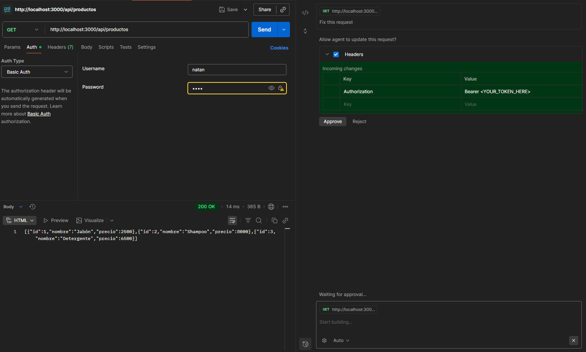

- como podemos ver este es el mismo que nuestro endpoint principal
## Post
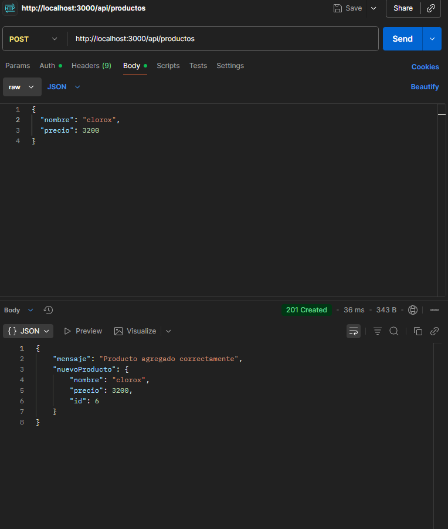

- aca probamos nuestro post y vemos como se agrega un producto correctamente

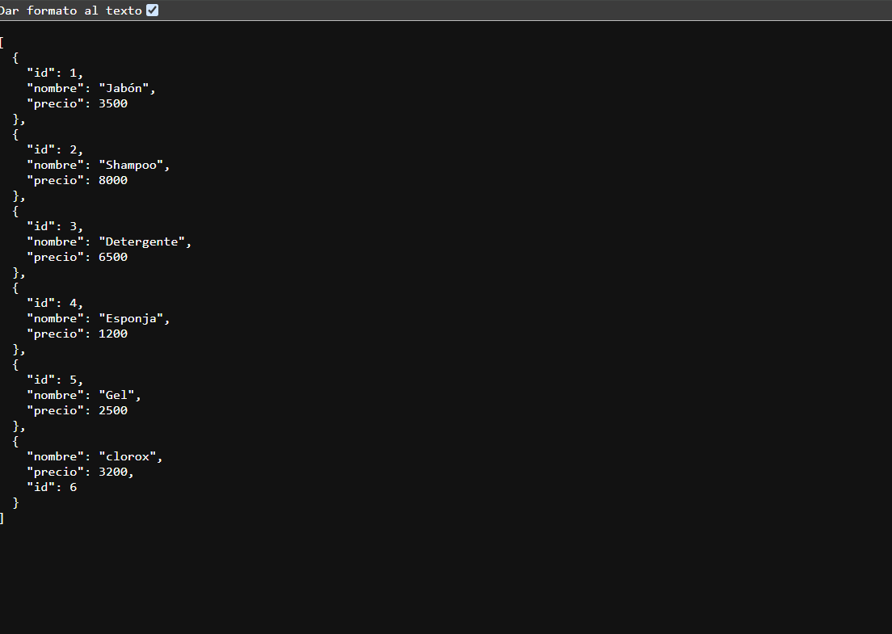

- esta es la ejecucion de el post en el endpoint cuando se actualizan los datos en el postman

## Put
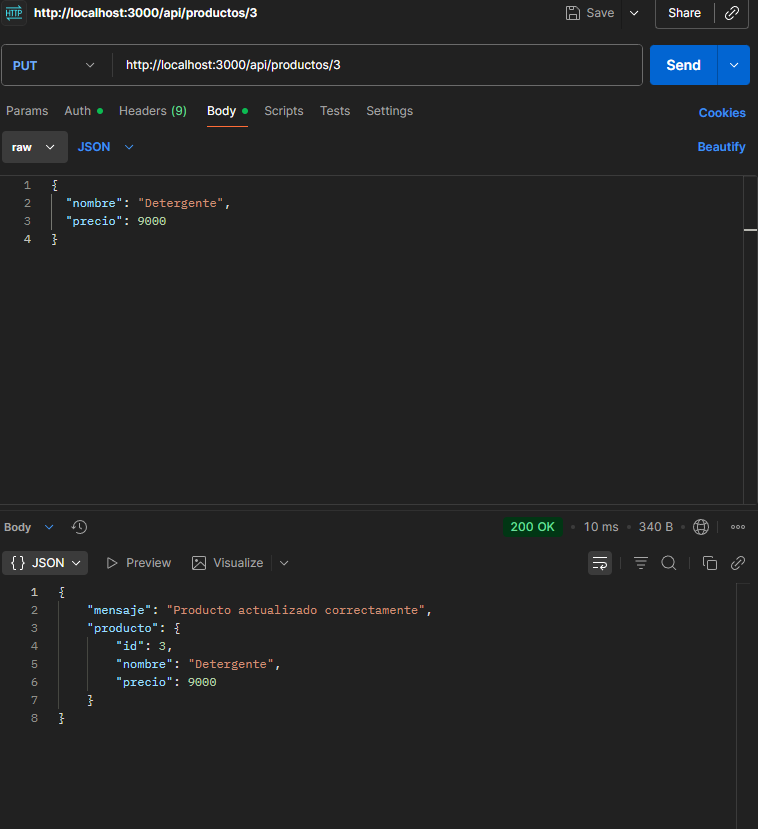

- aca vemos como se actualizan o se modifican datos de los productos que queramos

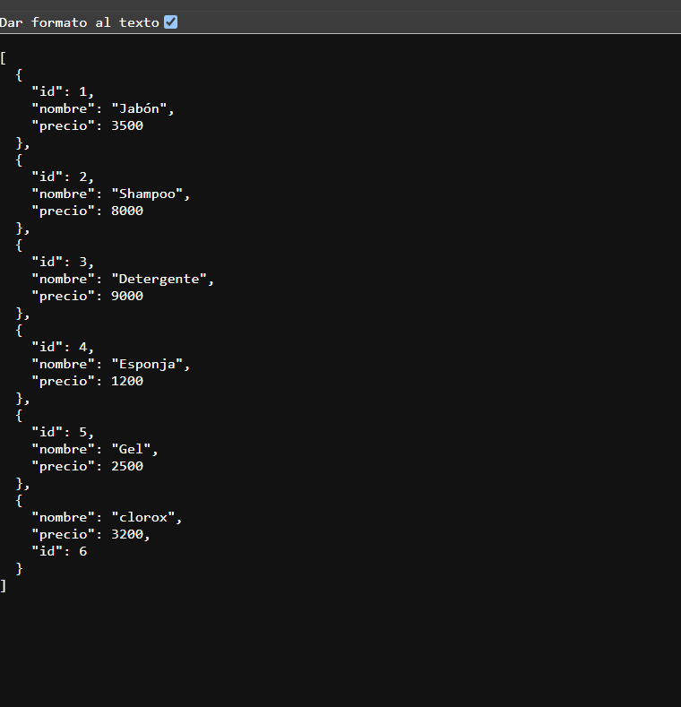

- aca se actualiza igualmente en el endpoint
## Delete
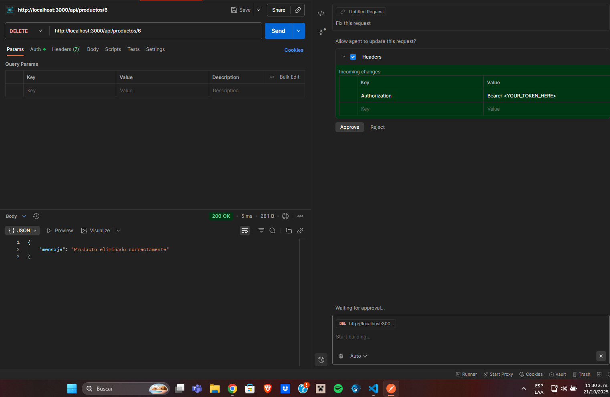

- aca se elimina un producto para despues verlo en el endpoint

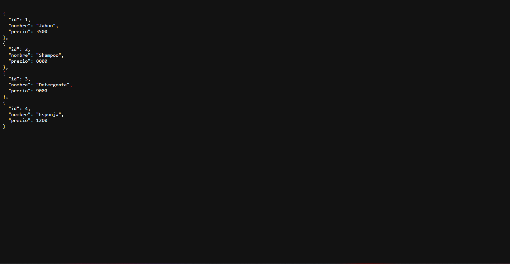

- se elimino el producto desde el postman

---

Todas las rutas fueron probadas con autenticación básica y devuelven los códigos que se esperaban.

---

##  Middleware Personalizados

###  autenBasica.js
Verificamos las credenciales del usuario para acceder a los endpoints.

###  validarProducto.js
Valida que los datos del producto sean correctos antes de crear o actualizar alguna otra informacion:
- Nombre no vacío
- Precio numérico y que los datos numericos sean mayor que 0

---

## Modelo de Datos

Definido en productosModel.js, simula una base de datos en memoria:

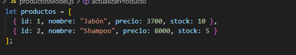

---

## Integración Continua (CI)

El proyecto usa **GitHub Actions** para ejecutar pruebas automáticamente con Jest cada vez que se hace un push o pull request en la rama main.

Archivo .github/workflows/ci.yml

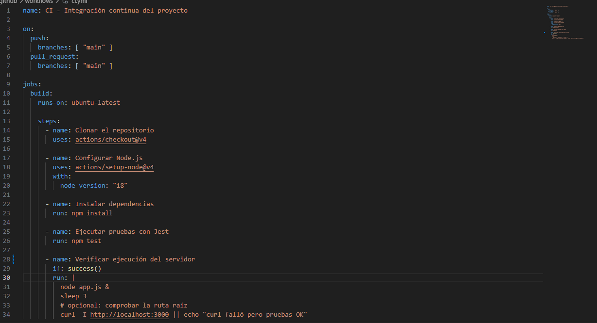
- Aparte de esto se usa pipeline en la opcion actions de gihub en donde vemos un cuadro que nos dice que las pruebas realaizadas son correctas

 
falta
## Pruebas Automatizadas realizadas con Jest 

Archivo: test/productos.test.js

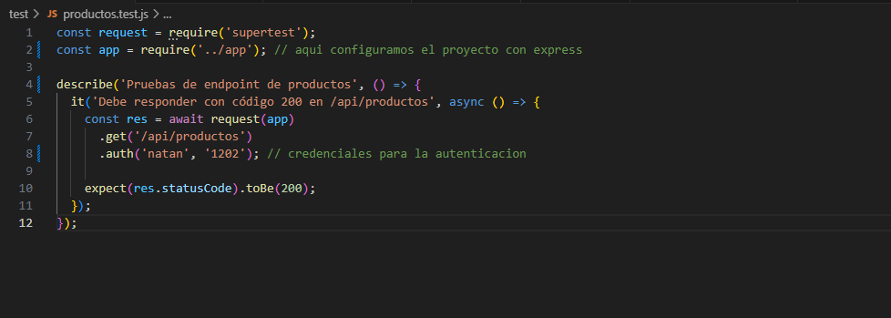

- este es el detalle de lo que se realiza para que las pruebas se ejecuten en vs
   
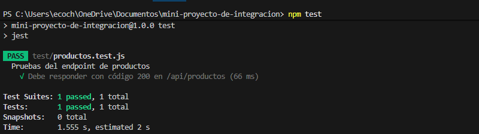

-aqui vemos que las pruebas corren perfectamente en el programa
---

## conclusiones
- Este proyecto nos enseño a aplicar los fundamentos del desarrollo de servicios API RESTful que se usan normalmente en el back-end utilizando Node.js y Express.
- implementamos correctamente los métodos GET, POST, PUT y DELETE para la gestión de productos de aseo desde el postman y nuestro endpoint.
- se aplicaron middlewares personalizados para la autenticación básica y la validación de datos
- realice pruebas ci y pipeline para el entendimiento de estA
- se implementa el endpoint para la lista de productos

---

##  Flujo del Proyecto (Diagrama)

- como ultimo punto adjunto la imagen de un diagrama de flujo del proceso de construccion de esta API RESTful
  

