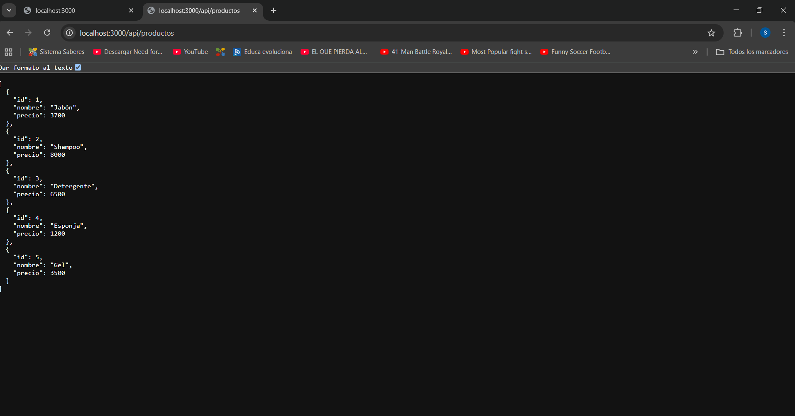
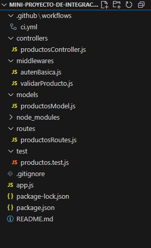
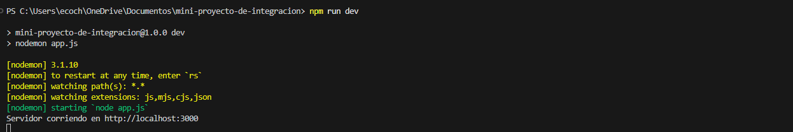
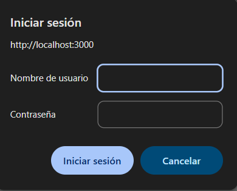
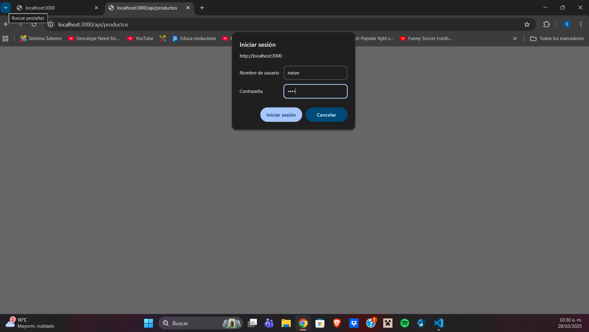
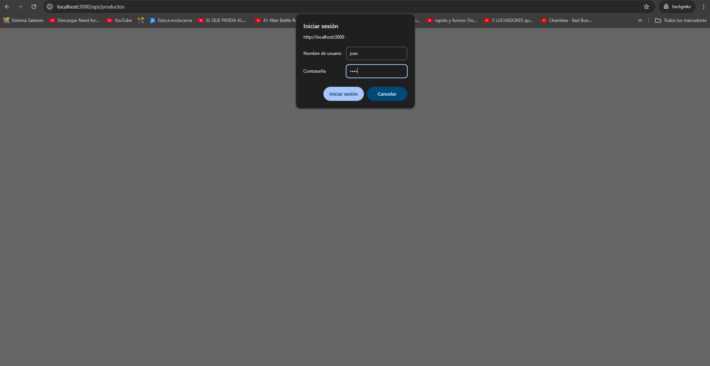
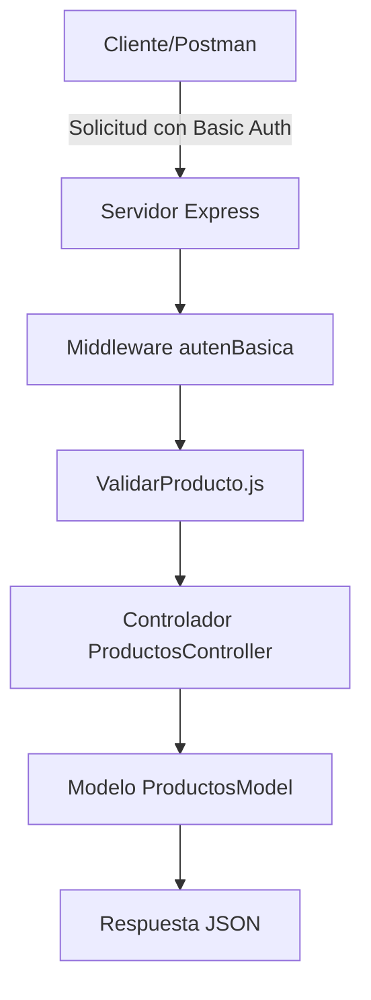

# Mini Proyecto de Integración o API RESTful de Productos de Aseo Natan Hernandez

---

## Descripción del Proyecto

Este proyecto consiste en el desarrollo de una **API RESTful** con **Node.js** y **Express** para gestionar un inventario de productos de aseo, el cual tiene como objetivo el uso de bases y estructuras de back end 
y la aplicacion de principios de programacion y metodos de desarrollo web, implementando algunas cosas como  pruebas automatizadas, y buenas prácticas de integración continua.

---

## Funcionalidad

La API permite realizar operaciones como (get,put,post y delete) sobre los productos,las pruebas de estas se hicieron en postman y se anexaran mas adelante con algunas imagenes para una mayor comprension de este.

| Método | Endpoint | Descripción |
|--------|-----------|-------------|
| **GET** | `/api/productos` | Obtiene la lista completa de productos |
| **POST** | `/api/productos` | Crea un nuevo producto |
| **PUT** | `/api/productos/:id` | Actualiza un producto existente |
| **DELETE** | `/api/productos/:id` | Elimina un producto del sistema |

Ejemplo de producto:


## Arquitectura y Organización del Proyecto

Esta API RESTful sigue una arquitectura MVC (Modelo-Vista-Controlador) tal como lo pedia la docente en distintos encuentros sincronicos, donde se separan responsabilidades para facilitar el mantenimiento del código.
###  Estructura del proyecto:

En este proyecto creamos varias carpetas para organizar los archivos, las pruebas y tambien la documentacion para su correcto funcionamiento.

--

##  Instalación y Ejecución

- instalamos nodejs para el correcto uso de la API RESTful
- Tener Git configurado
- Tener Visual Studio Code
- instalar Postman para pruebas de endpoints

### pasos a seguir
 - Acceder a la carpeta:
bash
cd mini-proyecto-de-integracion

 - Instalar dependencias:
   
npm install


 - Ejecutar el proyecto:
   
npm run dev

- iniciar manualmente:
  
npm start


Servidor disponible en:  
[http://localhost:3000](http://localhost:3000)




---

## Autenticación Básica

Lo que usamos para nuesta API RESTful fue proteger por autenticación **Basic Auth** para que la persona que quiera ver el contenido tenga que introducir una contraseña en especifico, a continuacion se mostraran las dos imagenes que se deberian ver al abrir nuestro endpoint.  

**Autenticacion correcta**


esta es la autenticacion que pedira el programa cuando se entre al endpoint para poder ver la lista de productos de aseo

aqui introducimos los datos correctamente para ver que pasaba y ver si el funcionamiento esta bien

si es correcto seberia aparecer nuestro endpoint, el cual mostramos anteriormente

**Autenticacion incorrecta**

en este caso pusimos datos incorrectos para saber que pasaba si le damos enter a esto

aqui vemos el mensaje que nos deja el programa al introducir los datos mal, por ello no mostrara la lista de productos propuesta

## Pruebas con Postman

Se realizaron pruebas en **Postman** para verificar los endpoints:
 
IMAGEN GET
IMAGEN POST
IMAGEN PUT
IMAGEN DELETE

Todas las rutas fueron probadas con autenticación básica y devuelven los códigos esperados (`200`, `201`, `404`).

---

##  Middleware Personalizados

###  `autenBasica.js`
Verificamos las credenciales del usuario para acceder a los endpoints.

###  `validarProducto.js`
Valida que los datos del producto sean correctos antes de crear o actualizar alguna otra informacion:
- Nombre no vacío
- Precio numérico y mayor que 0

---

## Modelo de Datos

Definido en `productosModel.js`, simula una base de datos en memoria:

```js
let productos = [
  { id: 1, nombre: "Jabón", precio: 3700, stock: 10 },
  { id: 2, nombre: "Shampoo", precio: 8000, stock: 5 }
];
```

---

## 🧰 Integración Continua (CI)

El proyecto usa **GitHub Actions** para ejecutar pruebas automáticamente con Jest cada vez que se hace un push o pull request en la rama `main`.

Archivo `.github/workflows/ci.yml`:
```yaml
name: CI - Integración continua del proyecto

on:
  push:
    branches: [ "main" ]
  pull_request:
    branches: [ "main" ]

jobs:
  build:
    runs-on: ubuntu-latest

    steps:
      - name: Clonar el repositorio
        uses: actions/checkout@v4

      - name: Configurar Node.js
        uses: actions/setup-node@v4
        with:
          node-version: "18"

      - name: Instalar dependencias
        run: npm install

      - name: Ejecutar pruebas con Jest
        run: npm test
```

---

## 🧪 Pruebas Automatizadas con Jest y Supertest

Archivo: `test/productos.test.js`

```js
const request = require('supertest');
const app = require('../app');

describe('Pruebas del endpoint de productos', () => {
  it('Debe responder con código 200 en /api/productos', async () => {
    const res = await request(app)
      .get('/api/productos')
      .auth('natan', '1202');
    expect(res.statusCode).toBe(200);
  });
});
```

Ejecutar pruebas:
```bash
npm test
```

---

## 🧩 Buenas Prácticas Aplicadas

- Estructura modular (MVC)
- Middlewares para autenticación y validación
- Control de errores HTTP
- Pruebas automatizadas (Jest + Supertest)
- Flujo de CI/CD funcional (GitHub Actions)
- Uso de Postman para pruebas manuales
- Uso de `.gitignore` y manejo de dependencias limpio
- Código limpio, comentado y documentado

---

## 📈 Estado del Proyecto

| Área | Estado |
|------|--------|
| **CRUD completo** | ✅ |
| **Autenticación básica** | ✅ |
| **Validación de datos** | ✅ |
| **Pruebas Postman** | ✅ |
| **Pruebas Jest** | ✅ |
| **Integración continua (CI)** | ✅ |
| **README documentado** | ✅ |

📊 **Porcentaje de cumplimiento estimado:**  
**100% — Proyecto completo y funcional**

---

## 🧭 Flujo del Proyecto (Diagrama)



---

## 👨‍💻 Autor

**Natan Hernández**  
Proyecto académico — *Desarrollo de Servicios Web / Ingeniería de Software*  
📅 Año: **2025**

---

## 🏁 Licencia

Este proyecto se distribuye bajo la licencia **ISC**.
Puedes modificar y utilizar el código con fines académicos o de aprendizaje.
